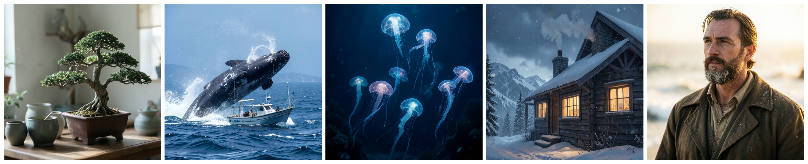

# bonsai-image-ios

An [mlx-swift](https://github.com/ml-explore/mlx-swift) port of [PrismML's
Bonsai Image](https://github.com/PrismML-Eng/Bonsai-Image-Demo) model — a
ternary-quantised FLUX.2 [klein] 4B — running on an iPhone. The model, and the
quantisation that makes it small enough to run on a phone, are PrismML's; this
repo is only the Swift inference port.

On an iPhone 12 Pro (A14, 6 GB, 2020) it generates a 512×512 image in roughly
140 seconds, with no network: about 12 s to encode the prompt with Qwen3, then
about 130 s to denoise (4 steps) and decode. The encoder and the diffusion
transformer are each loaded, used, and freed before the next loads, so peak
memory stays around 3 GB — roughly half the phone's.

> PrismML already ship a more capable
> [on-device app](https://apps.apple.com/us/app/bonsai-studio-by-prismml/id6767042620);
> this is our own port of their open weights, written to see how far an old
> phone would go.

<p align="center">
  
  <br><em>512×512, 4 steps, generated on-device on an iPhone 12 Pro.</em>
</p>

## Quickstart

New here? Pick your entry point:

- Run it on your iPhone — [get the weights](#get-the-weights), then
  [build the sample app](#run-it-on-a-phone) (one `xcodegen` command). Needs a
  ≥ 6 GB iPhone (A14 / iPhone 12 Pro or newer) and your Apple signing team.
- Verify the port on a Mac (no device) — [Verify the port](#verify-the-port-mac-parity-harness)
  runs the parity ladder and the full generate path against the real weights.
- Build on the engine — [Using the engine](#using-the-engine):
  `BonsaiPipeline(modelDir:)` is the one call from prompt to pixels.

## What's in here

| Path | What it is |
|---|---|
| `Sources/BonsaiEngine/` | the importable library — Qwen3 encoder, ternary DiT, VAE, scheduler, and the `BonsaiPipeline` one-call API |
| `Sources/BonsaiParity/` | a macOS executable that parity-checks each component against Python goldens, plus a full end-to-end `pipeline` run |
| `Examples/BonsaiDemo/` | a minimal SwiftUI sample app — `xcodegen generate`, then build to a device |
| `fixtures/` | golden tensors for the parity harness (gitignored; regenerate from the Bonsai-Image-Demo repo) |
| `docs/assets/` | the on-device sample renders shown above |

## How it works

The whole pipeline runs on the phone GPU, in sequential residency — each
model is loaded, used, and evicted before the next loads, so peak memory is
the largest single phase, never the sum:

```
prompt ─► Qwen3-4B encode ─► evict ─► ternary DiT (4-step denoise) ─► evict ─► VAE decode ─► image
         (~2.3 GB)                    (~1.4 GB)                                 (untiled)
```

Each component is checked against the Python reference (mflux-prism): the
quantised matmul is bit-exact, the transformer / VAE / preprocessing / end-to-end
all match to cosine > 0.999, and the tokenizer ids are exact.

## Get the weights

The pipeline needs four inputs. Three come straight from PrismML's public
model (Apache-2.0), no conversion — download it with the Hugging Face CLI:

```bash
huggingface-cli download prism-ml/bonsai-image-ternary-4B-mlx-2bit \
  --local-dir ~/models/bonsai-image
```

That gives you, under the model directory:

| Engine input | File in the download |
|---|---|
| DiT transformer (ternary 2-bit) | `transformer-packed-mflux/diffusion_pytorch_model.safetensors` |
| Qwen3-4B encoder (4-bit, group-64) | `text_encoder-mlx-4bit/model.safetensors` |
| tokenizer | `tokenizer/` |

The fourth input is the VAE — the FLUX.2 small decoder
([`black-forest-labs/FLUX.2-small-decoder`](https://huggingface.co/black-forest-labs/FLUX.2-small-decoder),
Apache-2.0), remapped to this engine's MLX key layout. Grab the prebuilt
`vae.safetensors` (~56 MB) from this repo's releases into the same directory:

```bash
gh release download v0.1.0 -R duration-ai/bonsai-image-ios \
  -p vae.safetensors -D ~/models/bonsai-image
# -> ~/models/bonsai-image/vae.safetensors
```

`BonsaiPipeline(modelDir:)` resolves all four from that one folder.

## Verify the port (Mac parity harness)

SwiftPM can't compile Metal shaders, so build the harness with `xcodebuild`:

```bash
xcodebuild build -scheme BonsaiParity -configuration Release \
  -destination 'platform=macOS' -derivedDataPath .xcbuild -skipPackagePluginValidation

export BONSAI_MODEL=~/models/bonsai-image
B=./.xcbuild/Build/Products/Release/BonsaiParity
$B            # 25-block transformer      $B vae   (BONSAI_FP32=1 for the fp32 golden)
$B preproc    # RoPE / grid / time-embed  $B qwen  # tokenizer ids exact + encoder embeds
$B e2egen     # full generate path
$B pipeline   # FULL end-to-end via BonsaiPipeline -> /tmp/bonsai-out.ppm (needs vae.safetensors in $BONSAI_MODEL)
```

Golden fixtures live in `fixtures/` (gitignored — regenerate them with the
`make_*_fixture.py` scripts in the Bonsai-Image-Demo repo; `BONSAI_FIXTURES`
overrides the path).

## Using the engine

`BonsaiEngine` is the importable library. The one-call path — point it at the
downloaded model directory and generate:

```swift
import BonsaiEngine

let pipeline = BonsaiPipeline(modelDir: "…/bonsai-image")   // resolves all 4 inputs
let (rgb, w, h) = try pipeline.generate(
    prompt: "a meticulously pruned bonsai tree, soft studio lighting, photorealistic",
    height: 512, width: 512, steps: 4, seed: 0,
    progress: { phase, frac in print(phase, frac) })        // row-major HWC uint8 RGB
```

It runs the full flow in sequential residency — encode → evict → denoise →
evict → decode — so call it off the main thread. `pipeline.weightsPresent()`
pre-flights the four files; `BonsaiPipeline.memorySnapshotMB()` reads MLX +
jetsam memory for a live readout.

<details><summary>Or drive the stages yourself (the lower-level API)</summary>

```swift
// 1. Encode the prompt, then free the encoder before the DiT loads.
let enc = try Qwen3Encoder(weightsPath: qwenSafetensors)
let ids = QwenTokenizer.promptIds(try QwenTokenizer.load(dir: tokenizerDir), prompt: prompt)
let (promptEmbeds, textIds) = enc.encode(tokenIds: ids)
enc.evict()

// 2. Denoise + decode (evict the 1.4 GB transformer before the VAE decode).
let gen = try BonsaiGenerator(transformerWeightsPath: ditSafetensors, vaeWeightsPath: vaeSafetensors)
let image = gen.generateImageTensor(
    promptEmbeds: promptEmbeds, textIds: textIds,
    height: 512, width: 512, steps: 4, seed: 0,
    vaeFp32: false, evict: true)
let (rgb, w, h) = gen.toRGB8(image)   // row-major HWC uint8 RGB
```
</details>

## Run it on a phone

[`Examples/BonsaiDemo/`](Examples/BonsaiDemo) is a minimal SwiftUI sample — a
prompt field with an Examples menu of ready-made prompts, and the rendered
image. It builds from the CLI via [XcodeGen](https://github.com/yonaskolb/XcodeGen),
with the weights bundled into the app (no Finder copy, no in-app download):

```bash
brew install xcodegen
cd Examples/BonsaiDemo
cp -Rc ~/models/bonsai-image bonsai-model   # weights from "Get the weights" — bundled in
xcodegen generate                            # -> BonsaiDemo.xcodeproj
open BonsaiDemo.xcodeproj                     # set your Signing team, pick a device, ⌘R
```

The model rides inside the `.app`, so the first signed build is slow (~3.7 GB
to sign). Device requirements, the memory entitlement, and a fast no-sign compile
check are in the [sample's README](Examples/BonsaiDemo/README.md).

Optional opt-in instrumentation (off by default) writes a per-phase,
fsync'd memory log that survives an iOS OOM kill:

```swift
BonsaiDebug.memLog = true   // -> <Documents>/bonsai-memlog.txt
```

## Credits & license

Apache-2.0 (see [LICENSE](LICENSE) and [NOTICE](NOTICE)). The model and its
science are PrismML's, built on FLUX.2 [klein] (Black Forest Labs) and
Qwen3 (Alibaba Cloud) — all Apache-2.0. This repository is only the
Swift / mlx-swift inference port and is not affiliated with or endorsed by them.
*Created using Bonsai Image by PrismML.*
